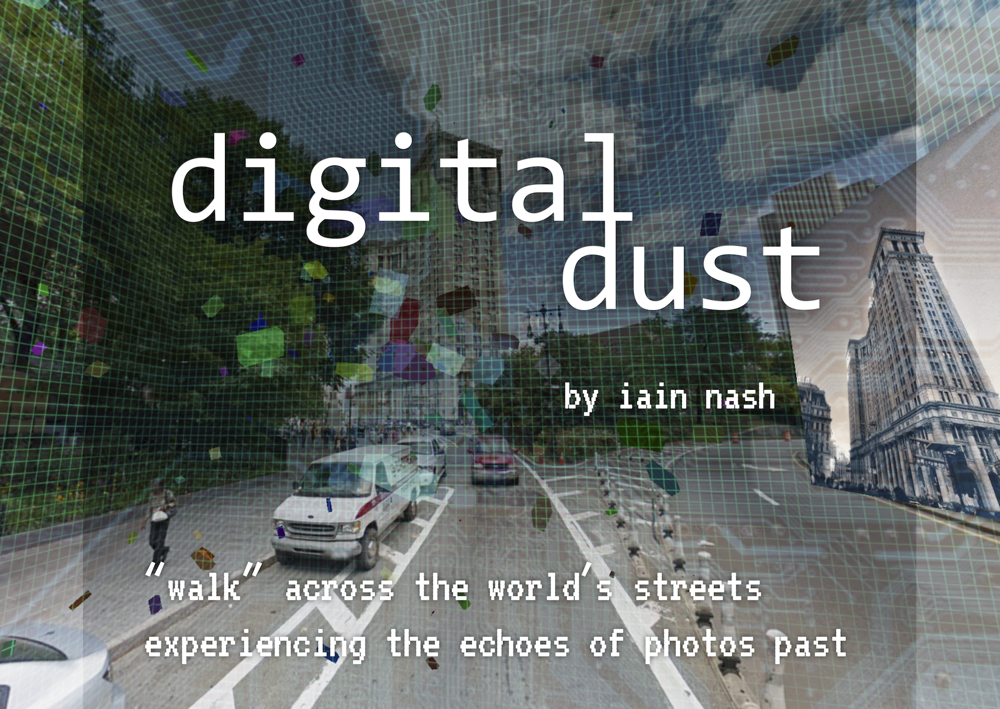
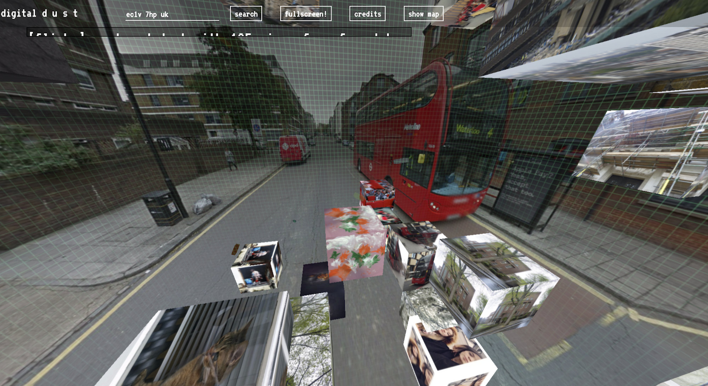
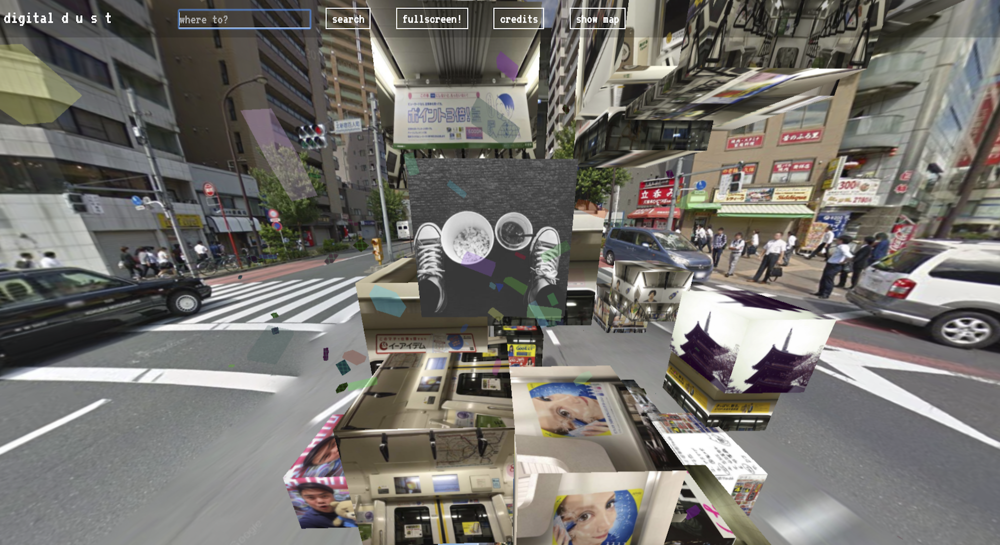

## Words from Digital Dust: The Afterlife of Forgotten Images

This is the code for a senior year USC interactive project.

The project was submitted to the second annual [Undergraduate Symposium for Scholarly and Creative Work](https://undergrad.usc.edu/experience/research/symposium/previous/spring2016/) winning 2nd prize in the Arts category.

My faculty sponsor was [Shannon Ebner](https://www.guggenheim.org/artwork/artist/shannon-ebner).

[Here is](http://dust.iain.in/) a live preview of the current application (not working due to API changes).

### Today

Unfortunately this code does not work as it originally did today. While the map view works with a valid API key, the flickr API has changed their access restrictions along with the Instgram API. The Instagram API now heavily restricts or has removed access to their public search by location endpoint which is the main data source for this application.

To have full functionality, in `js/modules.js` the `FLICKR_API_KEY`, `INSTAGRAM_API_KEY` and `FOURSQUARE_API_KEY` need to be replaced with valid API keys.

